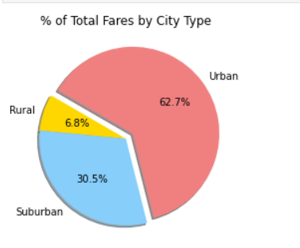
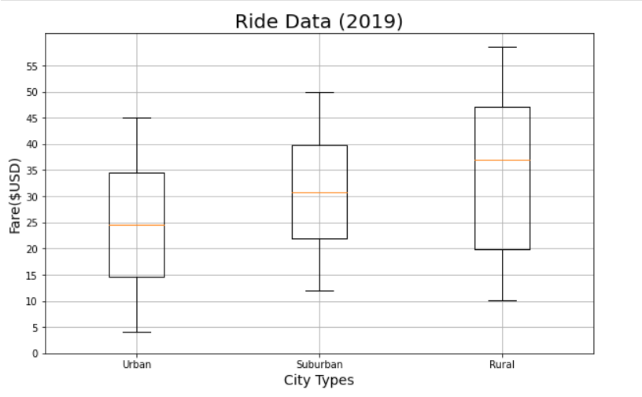
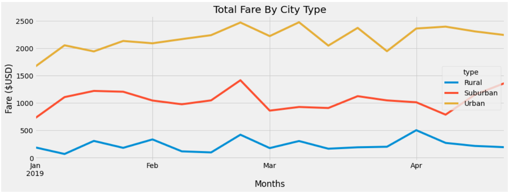
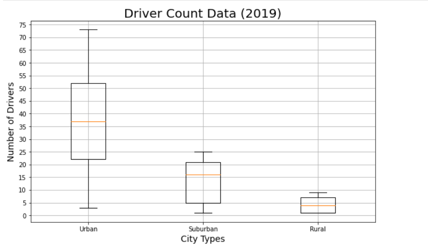

# PyBer Analysis

## Project Overview  
The purpose of this analysis is to create a visual summary of PyBer's ride-sharing data by city type (Urban, Suburban, Rural) and to compare their performace. Business recommendations are also provided to address potential disparities among city types. To accomplish this task, Python modules, such as Matplotlib and NumPy, are used to plot DataFrames.

---
## Resources  
**Data Sources:** All data used in this analysis is found inside of the [Resources](https://github.com/eric-blankinshp/Pyber_Analysis/tree/main/Resources) folder.  
**Software:** Python 3.7, Anaconda, Jupyter Notebook

## Results  
*There are only three categories of city types in this analysis: Urban, Suburban, and Rural. Please refer to the DataFrame below for a basic overview of the findings.*

### Urban Cities
The majority of PyBer's customers and drivers are located in Urban cities. As illustrated in the chart below, **these areas account for 62.7% of the total fares.** It is found that Urban cities have *thirty times* more drivers than Rural cities. However, due to the excess supply of drivers in Urban cities, the **average fare per driver is only $16.57**, which is the lowest of any market. This is the only city type where there are more total drivers than total rides.

### Suburban Cities
When compared to the Urban and Rural markets, the performance of Suburban cities is balanced and sustainable. Interestingly, the average Suburban fare is only $6.44 higher than in Urban cities, but the average driver fare is $22.93 higher than in Urban cities. There is a healthy balance of 490 drivers and 625 rides, which maintains a high average fare per driver. In all metrics analyzed, Suburban cities are consistently ranked in second place.

### Rural Cities

Rural cities on average have the fewest number of drivers and rides. Due to the low supply of drivers, **average fare prices in Rural areas are the highest of any city type** at $34.62 per ride. **[Only 2.6% of PyBer's total drivers are located in Rural cities](Analysis/Fig7.png)** even though these areas account for [5.3%](Analysis/Fig6.png) of Pyber's total rides. The low supply of Rural drivers has also increased the average fare per driver to be 40% higher than Suburban drivers and 235% higher than Urban drivers. Demand in Rural markets is outpacing the supply of drivers by a ratio of 2:1. The disparity in fare prices is illustrated in the plot below.

### Total Weekly Fares by City Type
The graph below illustrates the weekly fares of each city types from January 1, 2019 through April 29, 2019. Revenue in Q1 2019 has been static regardless of the city type. Fares in Urban cities hovered between $1,500 - $2,500, with resistance at $2,500. Suburban city fares were between  $500 - $1,500. Lastly, Rural city fares remained between $0 - $500.

## Summary and Recommendations
In this analysis, it is found that Rural cities have disproportionately higher fare prices and lower driver options than Urban and Suburban cities. These high Rural prices may be offputting to potential customers and deter new users from trying PyBer. **More drivers are needed to service Rural cities** to lower fare prices in these areas. As seen in the plot below, Rural cities have a severe shortage of drivers when compared to Urban cities. Providing incentives for new drivers or creating job awareness campaigns in Rural cities may increase the number of drivers to solve this disparity. 

However, **adding more drivers to PyBer must be a balancing act.** If there is an oversupply of drivers, such as the case in Urban cities, then the average driver fares will plummet. Low average fares may result in drivers leaving PyBer's platform or joining competitors. Closing the service gap in Rural areas would increase PyBer's total ride count and it is a vital strategy going forward. Furthermore, **it is critical to maintain high average driver fares,** which will motivate drivers to stay on PyBer. To address the low average fares per driver in Urban areas, it is recommended to increase the total ride count with marketing solutions, such as user discounts and targeted advertisements to increase demand and brand awareness. With these strategies in place, PyBer will be positioned to grow its current business and expand into new markets as well.

